# TripTrail by Apex Code

**Team:** Sivasubramaniam A/L Venkateswaran, Harein A/L Sathiamurthy, Esvan Rao A/L Perasath Raw, Liong Jiahe

**Problem Statement:** Travel Planner

**Video Presentation:** [Youtube](https://youtu.be/yV4sLNndJj0)

**Presentation Slides:** [Canva](https://canva.link/r6zd9xtew5966dj)

---

## Contents
- [1. Project Overview](#1-project-overview)
- [2. Ideation & Process](#2-ideation--process)
  - [2.1 Ideas We Considered](#21-ideas-we-considered)
  - [2.2 Ideation Boards](#22-ideation-boards)
  - [2.3 Mentor Consultation](#23-mentor-consultation)
- [3. Design & Prototype](#3-design--prototype)
- [4. What Makes It Different](#4-what-makes-it-different)
- [5. Technical Architecture & Feasibility](#5-technical-architecture--feasibility)
- [Extra](#extra)

---
## 1. Project Overview

### The Problem
Group trips break in two places: **getting to an itinerary**, and **sticking to it**.

Getting to an itinerary is slow because trip dates take weeks to agree on, nobody states their budget or what they want, and one person ends up spending hours researching and pricing the whole thing.

**The second one is what nobody solves**. Your itinerary can't see your live location. You planned lunch at 1pm; it’s 1:15 and you’re still at the beach, half an hour away. It doesn’t know that you are late. It can’t know if someone from the group went to find a washroom and hasn’t come back, or that the beach you’re heading to this afternoon is about to get rained on. Your phone already tracks all of it: GPS has your live location, Maps knows the restaurant is 30 minutes from it, the weather says it will rain by 3pm. The itinerary has never been connected to any of it. So people do the job manually instead. Someone must notice they're running late, figure out what still fits, mentally redo the rest of the day, retype it in the group chat, and make sure everyone sees it. Every time something slips from the initial plan.

**The causes, as we understand them:**

**Getting to an itinerary:**
* **Calendars never line up.** Four people, four schedules, no easy way to see which days everyone is free - so trips stall before they’re booked.
* **Group preferences are invisible.** Budgets, food needs and interests never get stated, so the loudest voice decides and the quietest person overspends without saying so.
* **Building it is hours of work for one person.** Research, order the days, price it, fit four sets of interests for four people.
* **No single place holds a trip.** Bookings in email, itinerary in Notes, budget in Sheets, decisions in WhatsApp. You're switching between four apps to answer one question, and none of them are open when you're actually out walking around.

**Sticking to the itinerary:**
* **The itinerary can't see what's happening.** It doesn't know you're late, early, separated, or heading somewhere it's about to rain so it never adjusts automatically.
* **One delay breaks every time after it.** You get to lunch 45 minutes late, so every stop after it is 45 minutes late too. Nobody re-edits the day mid-trip, so the times on screen stay wrong in your itinerary.
* **When a plan breaks, you start from scratch.** It rains, so you open Google Maps and start searching for somewhere indoor, but it doesn't know your budget, that two of you only eat halal, or that you still have a 7pm booking to make.
 - **You can't see your own group.** Someone wanders off in a crowded market and the next few minutes are spent calling around looking for them.
 - **What you spotted gets forgotten.** The place you walked past and meant to come back to. The scooter you parked and can't find at midnight.
 - **Spend is only counted at the end.** Cash and split bills mean nobody knows where the budget stands until the trip has finished.

Most of this hurts a group hardest, but a solo traveller has the same problems too. For example, a plan that slips, an afternoon plan rained out, a place walked past and forgotten, and no idea what’s been spent. They just have nobody to renegotiate it with.

### Stakeholders

| Who | The problem |
| :--- | :--- |
| **Group Trip organizer** | Builds the itinerary from scratch, then tries to keep the group on schedule during the trip. |
| **The rest of the group** | Have preferences and budgets they don’t want to argue about in a chat and don’t know the itinerary is running late until they're already late. |
| **The member with the tight budget** | Overspends rather than say so out loud and can't track spending during the trip. |
| **The first-time traveller** | Unfamiliar with the place; separation from the group is a real risk. |
| **Solo traveller** | Same problems, with nobody else to notice or help. |

### Similar apps, and why they fall short

| App | What it does | Where it stops |
| :--- | :--- | :--- |
| **Wanderlog** | Group itinerary building, route ordering, shared budget | Builds the itinerary and goes quiet. Nothing happens when the day goes wrong. |
| **TripIt** | Turns booking emails into a timeline, flight delay alerts | The app reacts to the airline, not to you. No group preferences, no re-planning of your own day. |
| **Layla (AI planner)** | Generates an itinerary, recalculates when you swap a stop | You must notice the problem and edit it yourself manually. |
| **Splitwise** | Cost splitting and settling up | Money only. Knows nothing about the plan. |
| **Life360** | Live location for a group | Just dots on a map showing location. No itinerary behind it, can’t re-plan your day. |
| **Google Maps** | Finds places near you and navigates you there, one trip at a time | Doesn't know your itinerary, your budget or your group's needs to recommend nearby places. |

**The gap:** every one of them re-plans when you edit it manually. None of them re-plan because of where the group's live location actually is.

### Solution
**TripTrail is a group trip planner that uses the group's live location to keep the itinerary accurate during the trip** Everyone sets their budget, free dates and preferences, votes by swiping on trip options, and the app builds a day-by-day itinerary with a time, price and location for every stop. From then on it compares where the group actually is against where the itinerary says they should be, so when they're running late, finishing early, separated or heading somewhere it's about to rain, it proposes a fixed version of the day instead of waiting for someone to notice. It works the same way for a solo traveller, minus the voting and the group map. **It works the same way solo**.

### Feature set

**Planning the trip**
1. **Create a trip and invite the group:** Name the trip, set a rough month and length, and share a link. You can either enter the dates yourself if they're already fixed, or let the group pick them from everyone's free days.
1. **Everyone fills in their own preferences:** Daily budget, the days they're free (tapped on a calendar), food needs like halal or vegetarian, three things they want to do, and one thing they don't.
1. **The app finds dates that work for everyone:** It compares all four calendars and shows which days the whole group is free.
1. **AI suggests trip options:** A few complete trips that fit everyone's budget, food needs and interests. Each card shows the cost per person, the dates all members are free, and a short day-by-day summary.
1. **Swipe to vote:** Right to like, left to pass, like a dating app. The trip with the most likes wins. (Travelling alone, you just swipe to pick your own.)
1. **You get a day-by-day itinerary:** A timeline for each day with a time and a price on every stop. You can also add your flight and hotel check-in manually, so the app plans the day around them.
1. **Edit anything in the plan:** Every stop has an Edit button, and you can add your own at any point in the day. The AI's version is a starting point, not something fixed.
1. **A budget bar:** Shows how much has been spent, how much the plan costs, and each person's budget, all in one line.

**Using live location during the trip**
1. **Stops tick themselves off when you arrive:** The app sees you're there, marks it done, and uses how long the journey actually took to correct the rest of the day's timings.
1. **It warns you before you're late:** It checks the time now, how far away the next stop is, and when that stop starts. If you won't make it, it proposes a new version of the rest of the day and shows what the change costs. You accept it or keep the original.
1. **It notices when you finish early:** And offers something nearby within budget, or moves the next stop forward.
1. **A live map of the group:** Everyone's position and phone battery on one map, so you can see who's nearby, who's fallen behind, and who's about to go dark. If someone's battery is nearly dead, the app sends the group their last known location automatically. (Group trips only.)
1. **Meet points and splitting up:** Drop a meet point for the group to head to, with directions and each person's ETA. If someone's too far away, the app can split the day in two and set a time to rejoin. (Group trips only.)
1. **Pin a spot:** Walk past somewhere that looks interesting and tap once to save it, instead of saying "we should come back here" and forgetting. Also works for where you parked. Pins show on the group's map, and you can add them to the itinerary later.
1. **"We're done here" button:** The app ticks stops off by itself, but you can also tap this while you're still somewhere to say you're finished. It then offers something nearby if there's spare time, or sends you to the next stop with directions.
1. **Rain backup plan:** If rain is coming where you are, the app suggests indoor places nearby that fit your budget and food needs.
1. **Quick spend check:** Food costs are only estimates, so when you leave a stop the app asks "About RM 16 spent?" Tap the tick or enter the real amount, and the budget bar stays accurate all trip.
1. **First-timer tips:** A short, useful line as you arrive somewhere, like "shoes off inside" or "cash only". On by default, easy to turn off.
1. **Close the day:** Tap "Done for today" to see what was planned versus what actually happened, change anything for tomorrow, then your location sharing switches off for the night. It turns back on an hour before your first stop the next day.
1. **Day recap to share:** A story-style card with the route you walked, the places you visited, distance travelled and the day's weather. Similar to what Strava does after a run, but for a day of travel. Sized for Instagram or WhatsApp stories, so you can post it in one tap.

---

## 2. Ideation & Process

### 2.1 Ideas We Considered

Table of every distinct idea generated, with why each was kept or dropped, order it so that chosen ideas are listed first:
| Idea | Why it was dropped / kept |
| :--- | :--- |
| **Live location driving the itinerary (CHOSEN)** | Kept, and became the core of the product. Every other planner only updates when you edit it manually or when an airline sends an alert. Nothing reacts to where the group actually is, so this is our differentiator and everything else is built around it. |
| **AI-built day plan (CHOSEN)** | Kept because building an itinerary is the tedious part — finding out what's worth visiting, working out a sensible order, and estimating what it all costs. The app does it from the group's answers and produces a timeline with a time and an estimated price on every stop. |
| **Swipe voting on trip options (CHOSEN)** | Kept. Each person swipes right to like or left to pass on a few AI-generated trip options, and the most-liked one wins. The dating-app style interface makes deciding fun and unique. |
| **Shared free-date calendar (CHOSEN)** | Kept. Agreeing on dates is the first thing that kills a group trip. Everyone taps the days they're free and the app shows which days the whole group can go. |
| **Preferences: must-haves, no-gos and food needs (CHOSEN)** | Kept because the app needs to know each person's priorities to build a fair itinerary. Capping it at three choices forces people to rank what matters most. Food needs are collected here too. |
| **Running-late detection and re-plan feature (CHOSEN)** | Kept. This is the feature that shows the whole idea working. Using the group's live location, the app compares the time now, how far they are from the next stop, and when it starts. |
| **Create a trip and invite by link (CHOSEN)** | Kept because getting everyone into the app has to be effortless. |
| **Running-early suggestions feature (CHOSEN)** | Kept. Using the group's live location, the app notices they've left a stop early and offers something nearby within budget. |
| **Live map of the group, with battery levels (CHOSEN)** | Kept because groups constantly lose track of each other. Everyone's position in one place, plus their battery level. |
| **Meet points and split-and-rejoin feature (CHOSEN)** | Kept. Groups split up all the time. Drop a meet point for everyone to head to, or let the app run two half-day plans. |
| **Pin a spot feature (CHOSEN)** | Kept. Discoveries during a trip usually get forgotten. One tap pins the spot to the group's map, and it can be added to the itinerary later. |
| **"We're done here" button (CHOSEN)** | Kept so the group can move on whenever they want, not when the plan says. |
| **Rain backup plan feature (CHOSEN)** | Kept. Weather is the most common reason a day falls apart. When rain is coming, the app suggests indoor places nearby. |
| **Quick spend check after leaving a stop feature (CHOSEN)** | Kept because most trip costs are only estimates. When the app sees you've left a stop, it shows the estimated cost and asks if that's roughly what you spent. |
| **First-timer tips on arrival feature (CHOSEN)** | Kept. The brief asks for less stressful travel, and for a first-timer the stress is from not knowing the small rules. |
| **Live budget tracker bar (CHOSEN)** | Kept because people don't want a total at the end of a trip, they want to know where they stand now. |
| **Editable itinerary (CHOSEN)** | Kept because the AI won't get everything right, and some things only the group knows. |
| **Done for today feature (CHOSEN)** | Kept because a day needs a clear end. Tapping it shows what was planned against what actually happened. |
| **Day recap story card (CHOSEN)** | Kept. A Strava-style card of the route you actually walked and experienced. Made to share on social media stories. |
| **Building it as an Android app (CHOSEN)** | Kept. Every re-planning feature depends on the app knowing where the group is while nobody is looking at their phone. Only a native app can keep reading location in that state. |
| **Reading the group's WhatsApp chat (DROPPED)** | Dropped after a mentor pointed out the cost: hundreds of messages per trip means a huge number of AI tokens. It was also risky for a demo. |
| **"Comfort nearby" feature (DROPPED)** | Dropped because Google Maps already does this better. Replaced with Pin a spot. |
| **Getting home check (DROPPED)** | Dropped because the data isn't there: last-bus times for local routes aren't reliably available, and live Grab fares need a paid partnership. |
| **Priority chips for preferences (DROPPED)** | Dropped because it asks people to learn a game before they can plan a holiday. Replaced with three must-haves and one no-go. |
| **Mystery Day (DROPPED)** | Dropped. On a holiday trip people would want their plan fixed, not turned into a mystery activity. |
| **Shared money pot (DROPPED)** | Dropped because it needs real payment handling, which we can't build in three weeks, and Splitwise already wins here. |
| **Captain of the day (DROPPED)** | Dropped because it's a social arrangement, not something an app can make people follow. |
| **Step counting on the recap card (DROPPED)** | Dropped because it made a travel app feel like a running app, and it needed health permissions. |
| **Building it as a website (DROPPED)** | Dropped for one reason: the web platform doesn't support background location tracking. |
| **Group chat inside the app (DROPPED)** | Dropped because casual chat is hard for AI to interpret reliably. |
| **Rating each stop after visiting (DROPPED)** | Nice idea, but if a trip is very short there isn't enough time for the app to learn anything useful before it's over. |
| **Public transport routing (DROPPED)** | Dropped because transit data for Malaysian local routes is patchy. |
| **Asking longer preference questions (DROPPED)** | Dropped because the longer the form, the fewer people may finish it. |
| **A daily spending leaderboard (DROPPED)** | Dropped. Turns money into a competition and quietly embarrasses whoever is on the tightest budget. |
| **Booking flights and hotels in the app (DROPPED)** | Dropped because it needs partnerships with airlines and hotels plus payment handling. |
| **Live prices pulled from booking sites (DROPPED)** | Genuinely better than estimates, but it needs partnerships or paid API access with every booking platform. |
| **Bank or e-wallet linked spending (DROPPED)** | Dropped because it needs banking permissions people won't grant for a travel app, and it misses cash entirely. |
| **Discreet recording or live-streaming when someone feels unsafe (DROPPED)** | Dropped. A safety button with nobody behind it gives people false confidence, which is worse than not having it. |
| **Storing photos of passports and travel documents (DROPPED)** | Dropped. Passport images are sensitive personal data under Malaysia's PDPA and require strict security beyond a three-week build scope. |

### 2.2 Ideation Boards

**User flow - from opening the app to the end of the trip**
Planning happens once, across the top. Everything below it repeats every day of the trip: the app watches where the group is, shows the matching alert on the Today card when something changes, proposes a fix, and waits for the group to accept before rewriting the itinerary. The day ends when someone taps "Done for today" and they review what actually happened, adjust tomorrow, and location switches off until the next morning.

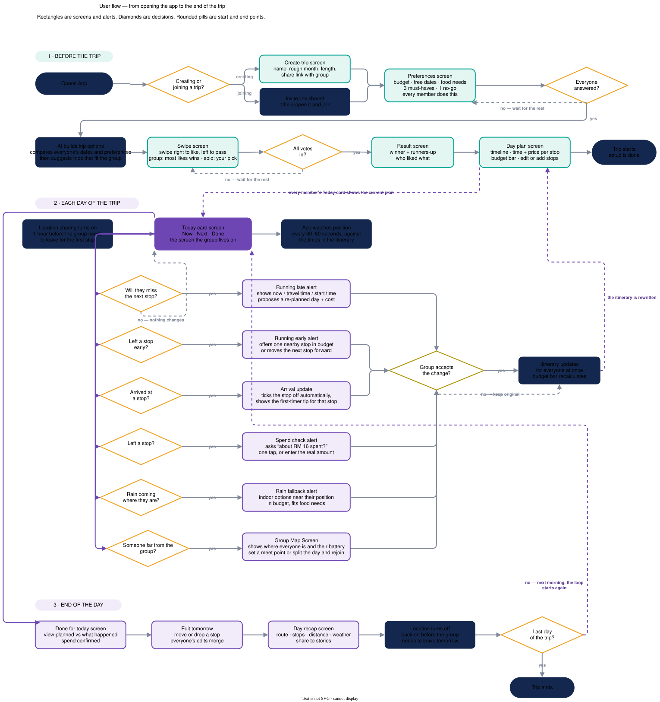

**Mindmap - every idea we generated, and what happened to it**
We took the four things the problem statement asks for and put every idea we had under them before committing to anything, then started cutting. 20 made it, 19 didn't, and the reason is written next to each one. The platform decision sits on its own because it isn't a feature. It's the choice between building an app or a website, and every location feature depends on getting it right.

[View my design on Canva](https://canva.link/mla5bjssi95xxmt))
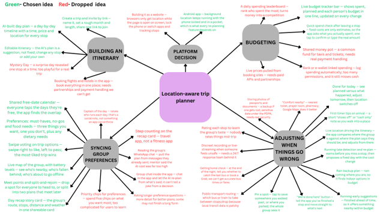

### 2.3 Mentor Consultation

| **Date** | **Mentor** | **Feedback Received** | **What Was Changed** |
| :--- | :--- | :--- | :--- |
| 6/9/2026 | Varsha Selvakumar | The AI Chat Exporter is possible but as an idea it is way too simple. Exporting full chats causes privacy issues. The Preference seeking from users and swiping UI/UX on it’s own is a strong and unique feature, so keep it. Try adding some Model Context Protocol (MCP) Server like getting weather index. | The AI Chat Exporter feature was removed. Preference collection and swipe based UI/UX feature are kept. |
| 7/9/2026 | Lim Zi Yang | Needs more unique features to stand out but the swiping UI/UX is a good idea. Try researching market competitors (e.g. Wanderlog). The "reschedule for bad weather" feature is too common, since most competitors already propose similar Plan B/C systems. Recommend finding something that’s unique. | AI Chat Exporter stays removed. The weather-based rescheduling idea was kept but implemented better: the app uses live location to detect the change in real time and actively swaps in nearby indoor alternatives for the affected stop. Did competitor research. |
| 7/9/2026 | Khor Jia Quan(Stefan) | The overall itinerary planning workflow is quite common, but the Tinder-style swiping feature is Good. There are similar products using AI chat features so maybe don’t make it your main core. Try to find something truly unique, that becomes the main selling point. | Major pivot: dropped the AI Chat Exporter entirely and replaced it with **live location tracking as the app's core differentiator**. The app now uses real-time GPS to detect when the group is running late, running early, split up, or has arrived. |
| 10/9/2026 | Khor Jia Quan(Stefan) | The live location tracking concept is a strong and really good idea. Mentor noted Part 1 is still common, but Part 2 (live tracking, re-planning, split-and-rejoin, getting home) is the main differentiator. Suggested an optional Strava-style shareable trip summary. | Safety/lost-member tracking added. App named TripTrail. Pin spot feature added. Food labels feature added. "Getting home" late-night screen added. Day recap "Strava-style" share card added. |
| 11/9/2026 | Lim Zi Yang | Liked the pin spot feature and the Tinder-style swiping. Mentor felt the overall solution was complete. Recommended Google Weather API over Open-Meteo. Suggested using a cheaper AI model (e.g. Gemini) to cut cost. | Changed Open-Meteo to Google Weather API. We are using Gemini instead of Claude AI. "Getting home" screen was removed as we felt it was too complex to get current fees. A new feature called check the spend added. |

---

## 3. Design & Prototype

**UI Prototype:** [Prototype Link](https://screenprototypeapexcode.vercel.app/)

The full prototype with all 15 screens is at the link above - the ones below are the key screens from the core flow.

### Key Screens
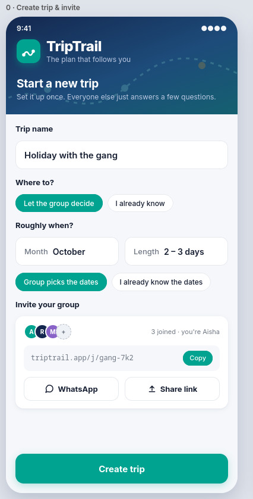

**Create trip & invite Screen**
* **Trip name** - just a label so the group can tell one trip from another.
* **Where to?** - *Let the group decide* leaves the destination to the swipe vote later. *I already know* is for groups who've settled it.
* **Roughly when?** - a month and a rough length, not fixed dates.
* **Group picks the dates / I already know the dates** - leave it on the first and everyone taps their free days later.
* **Invite your group** - avatars show who's joined. The link below can be copied, sent on WhatsApp, or shared.
* **Create trip** - pinned to the bottom, opens the preferences screen.
---

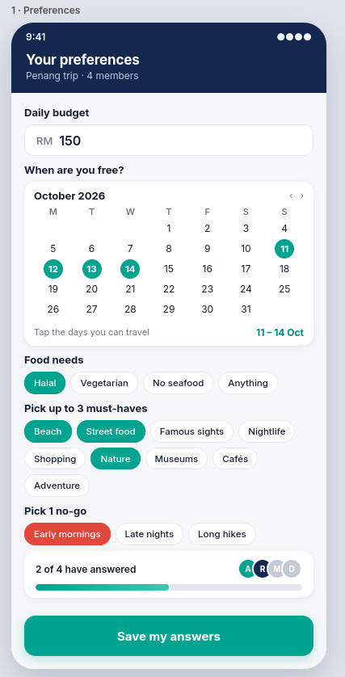

**Preferences Screen**
* **Daily budget** - a number in RM, entered privately by each person.
* **When are you free?** - tap the days you can travel.
* **Food needs** - halal, vegetarian, no seafood, or anything. Goes into the AI prompt.
* **Pick up to 3 must-haves** - the things you'd be disappointed to miss.
* **Pick 1 no-go** - the one thing you don't want.
* **2 of 4 have answered** - a progress bar and avatars showing who's done.
* **Save my answers** - pinned to the bottom.
---

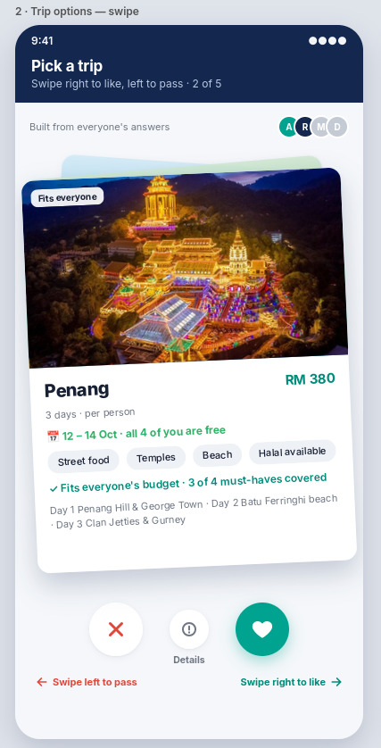

**Trip options swipe screen**
* **Header** - "Pick a trip · Swipe right to like, left to pass · 2 of 5"
* **"Built from everyone's answers"** with the group's avatars.
* **The card stack** - two more cards peek out behind the front one.
* **"Fits everyone" tag** - flags that this option clears every member's budget and food needs.
* **Photo, name and price** - the destination with the cost per person.
* **Dates line** - "12 – 14 Oct · all 4 of you are free", worked out from everyone's calendars.
* **Tag chips** - Street food, Temples, Beach, Halal available.
* **Details (middle)** - opens the full day-by-day plan for that trip before deciding.
* **Swipe hints** - "Swipe left to pass" and "Swipe right to like".
---

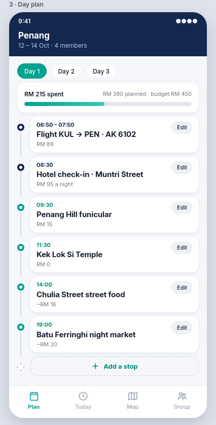

**Day plan screen**
* **Header** — "Penang · 12 – 14 Oct · 4 members".
* **Day tabs** — Day 1 / Day 2 / Day 3.
* **Budget bar** — three numbers in one line: spent on the left, planned and budget on the right.
* **Timeline** — every stop in order down the day, each on its own card with a dot on the line.
* **Edit on every row** — any stop can be changed, moved or removed.
* **+ Add a stop** — a dashed row at the end of the day.
---

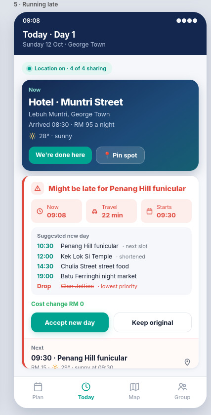

**Running late screen**
* **Header** - The day and place. The time in the corner matters here: it's what the alert below is reacting to.
* **Location pill** - "Location on · 4 of 4 sharing".
* **Now block** - where the group actually is. Buttons: We're done here and Pin spot.
* **The alert** - "Might be late for Penang Hill funicular" with a red stripe.
* **The three tiles** - Now 09:08, Travel 22 min, Starts 09:30.
* **Suggested new day** - the rewritten plan underneath.
* **Cost change RM 0** - in green. Every re-plan says what it does to the budget.
* **Accept new day / Keep original** - accepting rewrites the itinerary for everyone.
---

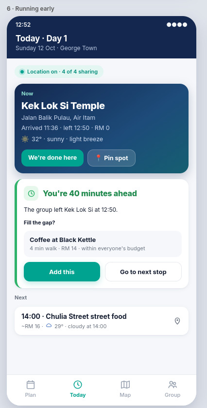

**Running early screen**
* **Header** - The day and place.
* **Now block** - arrived 11:36, left 12:50. That "left" is the trigger.
* **The alert** - green stripe this time. "You're 40 minutes ahead".
* **"Fill the gap?"** - the app doesn't just tell you you're early, it does something with it.
* **The suggestion** - Coffee at Black Kettle. One option, not a list.
* **Add this / Go to next stop** - accept the extra stop, or skip it.
---

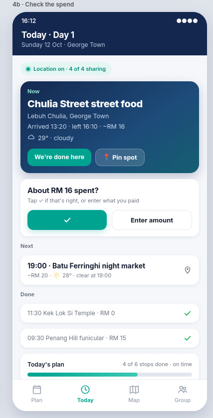

**Check the spend screen**
* **Now block** - arrived 13:20, left 16:10. The "left" is what triggers the prompt.
* **The prompt** - "About RM 16 spent?" Food prices are only estimates, so the app asks just after paying.
* **✓ and Enter amount** - confirm the estimate in one tap, or enter the real number.
* **Done** - the stops already finished, each with its final cost.
---

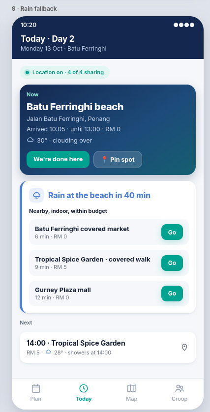

**Rain backup screen**
* **The alert** - blue stripe this time. "Rain at the beach in 40 min" — not a generic forecast, but rain where the group actually is.
* **"Nearby, indoor, within budget"** - the three filters the app applied.
* **Three options, each with Go** - walk time and cost on every one, nearest first.
---

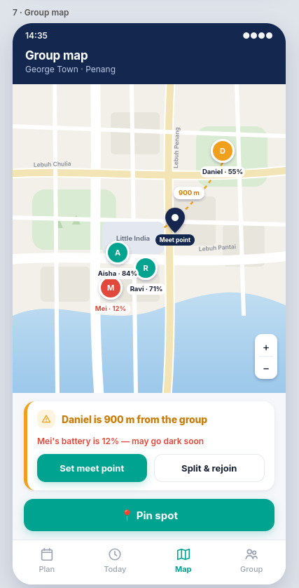

**Group map screen**
* **The map** - streets named.
* **The four members** - coloured circle with initial and battery percentage.
* **The navy pin** - "Meet point" — where everyone is going.
* **The alert** - amber stripe. "Daniel is 900 m from the group", and "Mei's battery is 12% — may go dark soon."
* **Set meet point / Split & rejoin** - actions based on the map context.
---

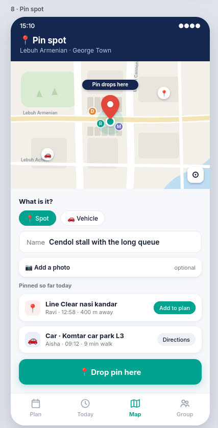

**Pin spot screen**
* **Header** - the street you're standing on.
* **The map** - your position, and a red pin labelled "Pin drops here".
* **"What is it?"** - 📍 Spot for a place, 🚗 Vehicle for where you parked.
* **Pinned so far today** - what the group has already saved.
---

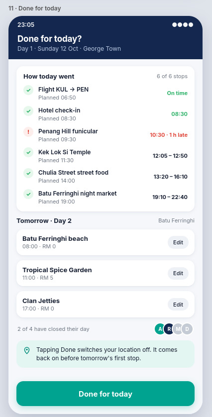

**Done for today screen**
* **How today went** - a checklist of every stop. Planned versus actual, side by side.
* **Tomorrow** - the next day's stops with an Edit button to change things while memory is fresh.
* **"2 of 4 have closed their day"** - who's already done this.
* **The teal note** - Tapping Done switches your location off for the night.
* **Done for today** - pinned to the bottom.
---

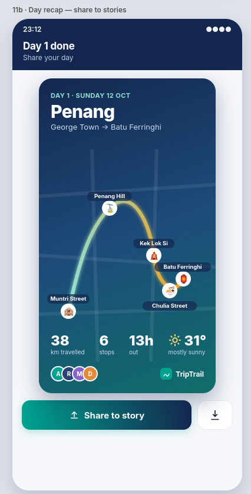

**Day recap screen**
* **The story card** — sized for Instagram or WhatsApp stories.
* **The trail** — the route the group actually walked, drawn as a glowing line.
* **The stop markers** — an emoji circle at each place.
* **The four stats** — 38 km travelled, 6 stops, 13h out, mostly sunny.
* **Share your day / Download** — post to stories or save to camera roll.

---

## 4. What Makes It Different

Most trip planners deal with one aspect of the problem: making a list, splitting a bill, or plotting dots on a map. TripTrail's model is unique, it integrates the capabilities of AI itinerary generation, group preference voting and real-time GPS-based replanning into a single app.

### Novel features
1. **Re-planning due to location, not editing.** All other planners wait for you to edit manually. TripTrail compares the group's current location with the plan and provides a solution before anyone opens the app.
2. **The alert will be attached to the modified plan.** The app displays three numbers side by side ("now 09:08, travel 22 min, starts 09:30") allowing the group to see the maths. The rewritten day is physically attached to the Next card it affects.
3. **Whole trips swipe voting with date-fit.** Preferences are gathered as a game. Each trip card also displays the dates when each member is free.
4. **Pin spot.** Tap to mark a location that you walked by or parked the car. Shared with the group instantly and addable to the plan later.
5. **Tips for first timers.** A short practical line on arrival at each stop (e.g., "shoes off in prayer hall").
6. **Honest money.** Estimates are displayed with a `~` and when the group departs, the app asks "About RM 16 spent?" with a quick tap to confirm or override.
7. **Split and rejoin.** If a member wanders off, the application suggests two mini-plans and a common rejoin point.
8. **Location that follows the itinerary, not the clock.** Tracking switches on before the day's first stop and off when each person taps "Done for today." No always-on tracking.

### Comparison with similar apps

1. **Wanderlog:** Builds the itinerary, then goes quiet. Nothing happens when the day goes wrong.
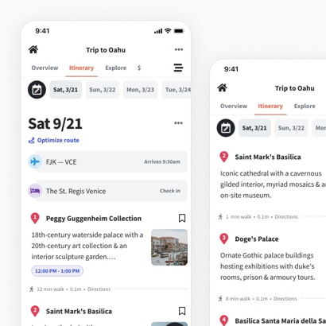
    *   **TripTrail:** Sees from the group’s location that they’ll miss the next stop, and proposes the fixed day automatically.
    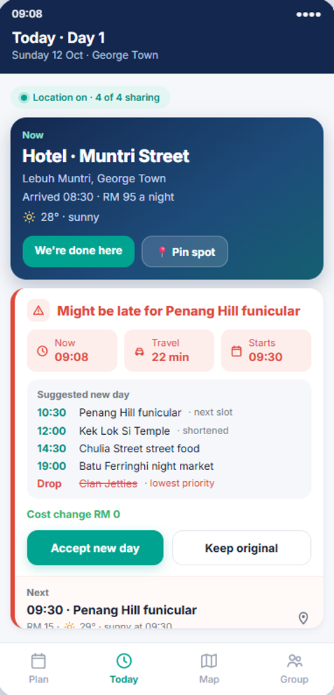
1. **TripIt:** Reacts to the airline, not to you. No group preferences, no re-planning of your own day.
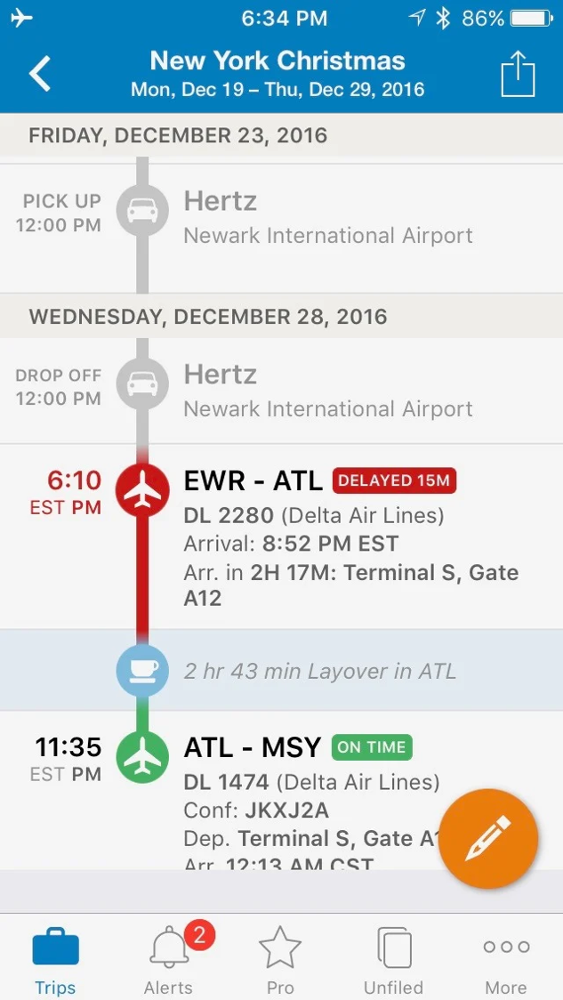
    *   **TripTrail:** Reacts to where the group actually is, including the weather at that exact spot.
    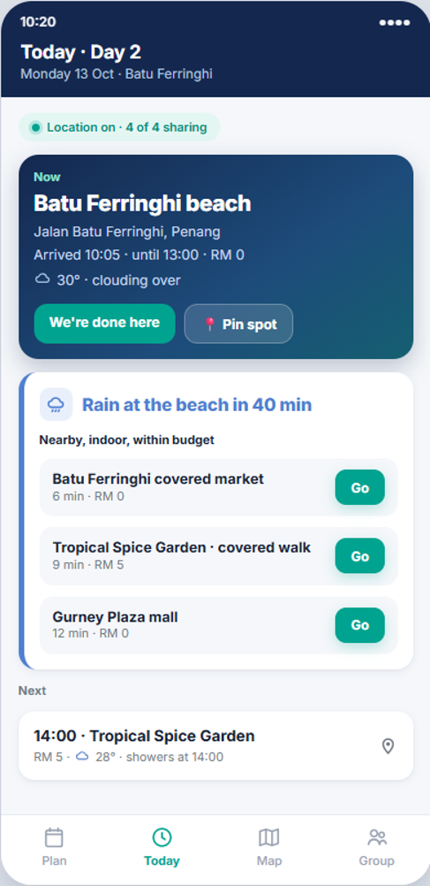
1. **Life360:** Shows dots on a map with no itinerary behind them.
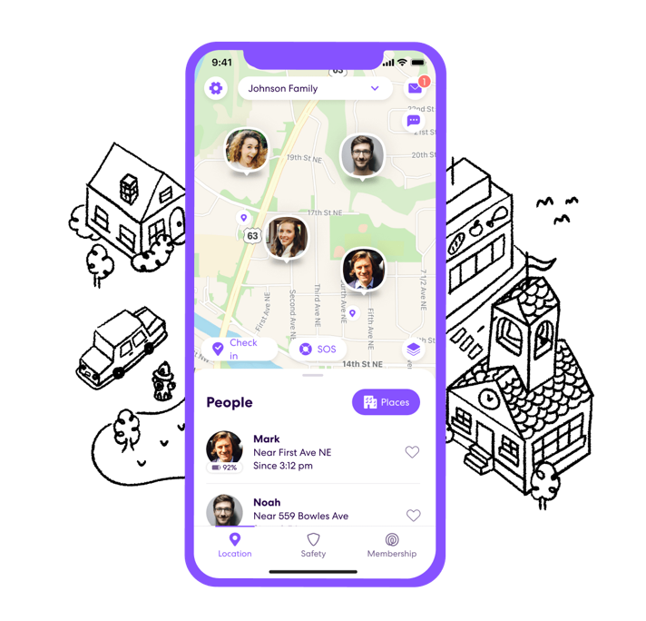
    *   **TripTrail:** Uses live positions, but has a feature to set a meet point or adjust itineraries.
    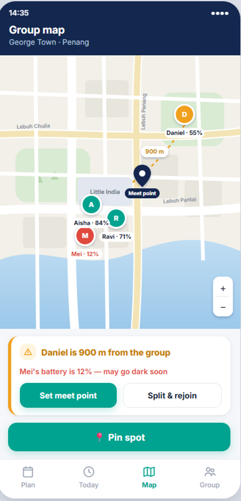
1. **Splitwise:** Settles up bills after the trip is over.
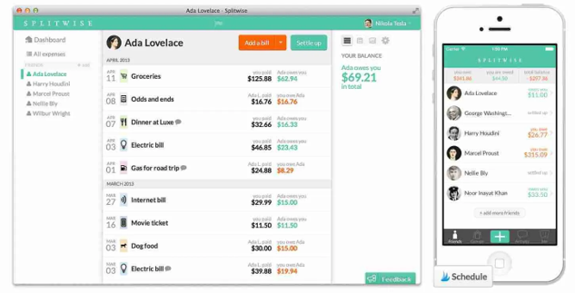
    *   **TripTrail:** Tracks live, inside the day plan, as it happens.
    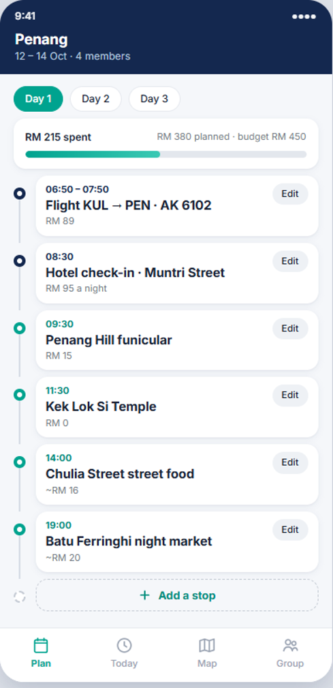
1. **Layla:** Creates an itinerary, but you have to spot the problem and edit it yourself.
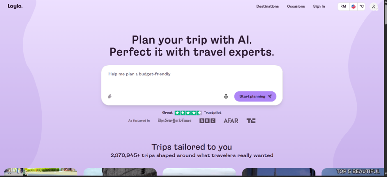
    *   **TripTrail:** Spots the problem and suggests the fix before anyone opens the app.
    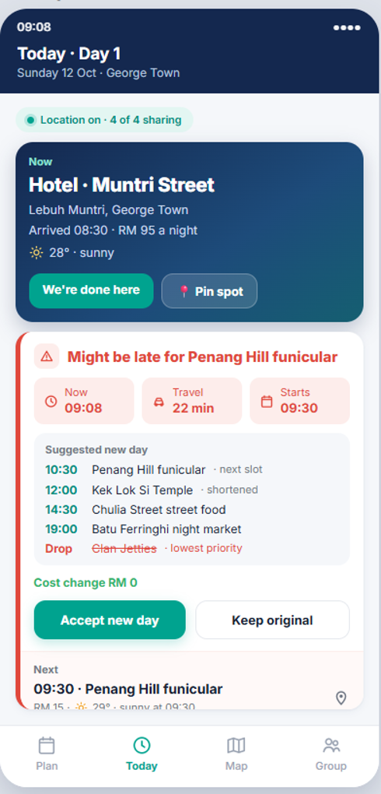

---

## 5. Technical Architecture & Feasibility

### Tech Stack

| Layer | Choice | Why we chose it | Constraint we expect |
| :--- | :--- | :--- | :--- |
| **Mobile App** | Expo (React Native), Android only | React is what we know. Expo handles the hard native setup. | iOS needs a paid Apple developer account, so we may add it later. |
| **Background Location** | `expo-location` and `expo-task-manager` | App keeps sending position every 30-60s with the screen off. | Drains battery and shows a permanent "using your location" notification. |
| **Backend & Database** | Supabase (Postgres, Auth, Realtime) | Gives login, database, and live updates without writing a server. | Free tier pauses after 7 days of inactivity. |
| **Maps & Travel Time** | `react-native-maps` + Google Maps Platform | Providing accurate places, coordinates, and real travel times. | Quota limits require us to cache travel times. |
| **Halal Checking** | JAKIM halal directory | Google has no reliable halal flag, so we match against JAKIM. | Name matching is fuzzy, so we label by confidence. |
| **Weather** | Google Weather API | Accurate detailed forecasts. | Requires Google Cloud billing account, needing careful cache management. |
| **AI** | Google Gemini | Writes the trip options, itinerary, and first-timer notes. | Strict rate limits (10-15 RPM) can trigger HTTP 429 errors if multiple users burst requests. |
| **Hosting & Distribution** | Vercel & EAS Build (Expo) | Serverless hosting for API keys; cloud APK builds. | EAS free tier has a monthly build limit and queues. |
| **Budget & Spend Tracking** | Supabase tables | Syncs confirmed spend instantly via Realtime. | AI-estimated costs are approximate. |

### System Architecture Diagram
*   **Android Client:** Expo Maps SDK, Background Location & Battery Status, UI Layer.
*   **BaaS (Supabase):** Authentication, Database, Real time broadcast location data.
*   **Compute Layer (Vercel):** Generate Trip Options, Generate Itinerary/Budget, ETA Check, Nearby Comfort Spots, Rain Fallback, Food Check.
*   **External APIs:** Google Maps Platform, Google Gemini API, Google Weather API, JAKIM Halal Directory.

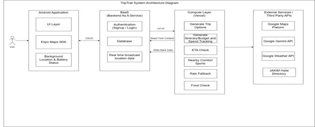

### Build Plan & Scope
*   **Must build:** Sign up, create trip, invite by link, preferences form, AI trip options, group vote, AI itinerary, background location tracking, today card with auto-arrive, running late alert, group map, budget bar, quick spend check, and done-for-today review.
*   **Should build:** Running early, first-timer note on arrival, pin spot, and split & rejoin.
*   **May build:** Rain fallback near current location, day swap for bad weather, flight-delay mini-plan, and day recap card.
*   **Not building:** iOS version, bookings, payments, cost settlement between members.

### Timeline
*   **Week 1:** Background tracking works, plan side works end-to-end.
*   **Week 2:** Location drives the plan (auto-arrive, ETA check, running-late re-plan, done-for-today review, group map).
*   **Week 3:** Fill in and polish (pin spot, split & rejoin, first-timer notes, day recap, UI polish, APK build, test, record video).

### Resource, Skill, and Cost Awareness
*   **Time Limitations:** 3 weeks of building. We prioritized core location-tracking features for the MVP and deliberately left out iOS development and live bookings.
*   **Skill Requirements:** We have basic knowledge of React, JS, HTML/CSS, Git, and SQL. We lack experience with native background services, bridged by choosing Expo and Supabase.
*   **Cost Limitations:** Total cost is RM0 using free tiers for Expo, Supabase, Vercel, Google Maps, and Google Gemini. Caching travel times and restricting AI calls to three specific moments avoids rate limits and overages.

# Extra

### Solution Effectiveness & Impact (The Before & After)
**The "Before" (Current State):**
Group trips are currently run through a scattered patchwork of disconnected tools (WhatsApp chats, Discord Channels). One person carries the planning burden alone, and the whole plan falls apart the moment something unexpected happens. People are quietly disappointed about schedules or budgets they were afraid to push back on.

**The "After" (With TripTrail):**
Preferences are collected without confrontation (via swiping and private inputs). The itinerary adjusts itself in real time as the trip unfolds, instead of relying on one person to hold everything together. Costs are tracked as they happen instead of reconstructed afterward.

### Target Audience Alignment
**Primary user:** Friend groups of 4 to 8 Malaysians aged 18 to 30 on their first few trips together, planning everything over WhatsApp.

| User Persona | Specific Pain Point | How Our Solution Aligns with Their Needs |
| :--- | :--- | :--- |
| **Aisha, 22, the organiser** | Books everything and gets blamed when the day falls apart | Preferences and swipe voting mean the group decides together. Live re-planning takes the scrambling off her hands. |
| **Ravi, 23, the "anything lah" member** | Never states a preference, then is disappointed | The quick form only needs 30 seconds of input, so his picks are protected when the day gets re-planned. |
| **Mei, 21, the tight budget** | Won't say "that's too expensive” in a group chat | Budget is entered privately at the start, and every re-plan shows the cost change before anyone agrees to it. |
| **Daniel, 24, the first-timer** | Doesn't know local customs and worries about getting separated | First-timer tips appear automatically on arrival. Group map with a shared meet point means a split group is a quick fix. |
| **Dietary needs across the group** | Finding food everyone can eat | Food needs go into the preference form up front, and food stops are verified. |

### Reach, Scalability, and Future Growth
*   **Phase 1 (Initial Release):** First 1,000 users would be university students in Malaysia planning short domestic trips during semester breaks.
*   **Phase 2 (Expansion):** Expand to young working professionals planning regional trips (Bangkok, Bali). Add an iOS version.
*   **Phase 3:** A booking platform could eventually plug into TripTrail as its front end. Completed itineraries become valuable local routing data.
*   **Technical Scalability:** Supabase handles database hosting and scaling. In-day logic runs on the phone itself, reducing server loads.

### Why a mobile app and not a web app
A browser can read GPS, but only while the page is open on screen. Lock the phone or switch to WhatsApp and updates stop. Our core feature needs location even with the screen off while walking between stops. That is a native capability. We build for Android first and share the app as an APK download link.

## UX/UI & Accessibility Justification

### Visual Consistency & Design System
*   **Palette:** Navy (`#14284F`) for structure and all “Now” blocks. Teal (`#00A38F`) for every primary action. Colour has one meaning: red for a problem, green for good news, amber for something worth knowing, blue for weather.
*   **Typography:** One sans-serif (Inter) at four sizes, held identically across all screens.
*   **Components reused:** Bottom nav, alert stripes, and buttons are consistently deployed across all screens.

| UI | Details |
| --- | --- |
|  | The complete system in one screen: Budget bar, coloured stop markers and card shapes. Why this design for the user. Young Malaysians who reside in Grab, Foodpanda and Instagram. Clean, bright, rounded, high contrast , easy to use without a tutorial. |
|  | A story card that can be shared with route, stats and the TripTrail mark, designed to be posted, not just viewed. |

### Usability & Friction Reduction
*   **One thing at a time:** The Today card only displays Now, Next and Done.

| UI | Details |
| --- | --- |
|  | Now (Kek Lok Si Temple, arrival + weather), Next (Chulia Street street food), Done , nothing else on screen. |

*   **Alerts sit under Now, not over it:** The rewritten day sits directly below the Now card it explains.

| UI | Details |
| --- | --- |
|  | "Might be late for Penang Hill funicular" shows Now 09:08 / Travel 22 min / Starts 09:30 side by side, then the rewritten day underneath, directly below the Now card it explains. |

*   **The app suggests, the person chooses:** "Accept new day" and "Keep original" are always placed side-by-side. There is no change without a tap.
*   **Thumb-first:** Primary action is always at the bottom of the screen.
*   **Two-minute onboarding:** Fast and frictionless input flow.

| UI | Details |
| --- | --- |
| 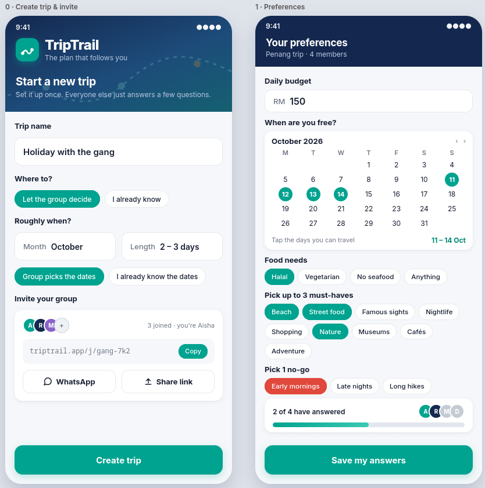 | Trip name, a "let the group decide" toggle and invite link on one screen, budget, calendar tap and a few chips on the next. Progress without a status page is indicated by "2 of 4 have answered". |

*   **Money is never a separate screen:** "About RM 16 spent?" pops up organically within the day's flow.

| UI | Details |
| --- | --- |
|  | The app asks "About RM 16 spent?" with a one-tap confirm or manual override, and the amount spent is recorded on the plan. 

Core flow, end-to-end. There are no dead ends on the 15 screens that cover all the branches off that spine: 0 → 1 → 2 → 3 → 4 → 11 (Create trip → Preferences → Swipe → Day plan → Today card → Done for today). |

### Live Location Surfaces: Map & Pin Spot
Both screens reuse the exact same bottom nav, the same teal primary button, and the same card radius, so the map doesn't feel like a different app, it feels like a different view of the same one. Meet point, Split & rejoin, and Pin spot sit as one-tap actions below the map.

| UI | Details |
| --- | --- |
|  | The same bottom nav, chips, buttons, and colour system carry into the map. Each member is a coloured avatar with an initial and a battery %, so you can read the group at a glance without relying on colour alone. Meet point, Split & rejoin, and Pin spot sit as one-tap actions below the map. |
|  | Pin spot uses the same card, chip, field and button components as the rest of the app. One tap drops a pin; you choose Spot or Vehicle, name it, and it appears for the group instantly. Recent pins can be added to the plan later. This is the screen that proves the app remembers what Maps can't. |

### Accessibility Considerations
*   **Colour is never the only signal:** E.g., The blue "Rain" card has an umbrella icon and a clear headline.
*   **Contrast:** White on navy for all "Now" blocks, dark text on white for all other blocks.
*   **Tap targets:** Primary buttons are full width, 44–50px. Text sizes are based on the phone's system scale.
*   **Plain language:** Tips are written practically and conversationally ("Shoes off in the main prayer hall.").

| UI | Details |
| --- | --- |
|  | The blue "Rain at the beach in 40 min" card has an umbrella icon and a complete headline , the warning is still there without colour. |

---

## Value Proposition & Engagement Hook

**Elevator Pitch:**
Every travel app can build you an itinerary, but none of them can use your live location to change it.

**Why It Must Be Built:**
It's not where we began. Our first idea was to send our own apps to read the conversation from our group on WhatsApp, and pull out the date and budget we'd already discussed, but our mentor quickly pointed out that: 1) A group chat about a trip isn't only about the trip; 2) Asking people to hand over months of private chats just to plan a weekend in Penang is not a feature, it's a liability. The privacy aspect aside, a couple days ago a second mentor gave us the same opinion from a different perspective: “Even if it wasn't for the privacy, an app that reads chats that you read anyway is not unique enough to be the reason why anyone would pick it over Wanderlog.” In one meeting we tossed it in. We took away from that discussion was the truth below the surface: why do you have to type something, or explain something, when your phone knows exactly where you are at?

This is the entirety of the product now. It's 09:08. You're at the hotel. The funicular leaves at 09:30 and the station is 22 minutes away. Your tour plan is oblivious of that. TripIt would await an airline. Wanderlog would wait for you to come back and repair it yourself. Life360 would display four dots on a map and that would be it, no one had anywhere to go. So, none of them are watching you right now, although the phone in your pocket has known your location all the way.

This was created for the trip that is being planned in a Malaysian group chat this week. It is Aisha who does it all: books the flight with her own card and then spends three weeks getting RM 89 from them all. Ravi, who means "anything lah" up until the plan fails to please him and only then says so, not beforehand. Quietly spending more than budgeted, rather than saying that it's too expensive for her to take the trip. On his first time at an unfamiliar place, Daniel was more concerned with getting lost in George Town than with the agenda. They don't want a smarter to-do list. They want it to see what they don't tell anyone else — the late clock, the money that's spent but not said, the halal stop that isn't on Google but on JAKIM's list.

It's the space that all the current apps fill and it's bigger on the inside than it is on the outside. In each group, someone takes on the unofficial task of being the unpaid project manager for the whole trip: the person who notices the time first, does the calculation of whether the day will be okay, types a new plan into the chat, and hopes everyone reads it before the next day falls apart too. It's invisible work, it's always the same person doing it, and no travel app ever has attempted to do it. TripTrail is to ensure that it doesn't exist in the first place, for the organiser who's tired of being the guy who plans and fixes all the things and for everyone else in the chat who just never knew that there was a job being done for them.

It's 09:08 and you're at the hotel, the funicular leaves at 09:30 and the station is 22 minutes away; your itinerary wouldn't know that, ours would.

